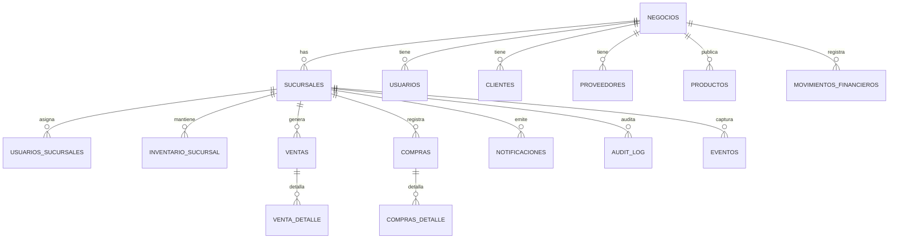

# Informe tecnico - base de datos multi negocio

Ultima actualizacion: 2025-10-23 (migracion 08 - reporting).
Este documento es la unica referencia oficial sobre el modelo de datos y debe mantenerse sincronizado con los scripts en `scripts/`.

## 1. Tablero de tablas y alcance

| Tabla | Columna negocio_id | Columna sucursal_id | Nivel de alcance | Comentarios clave |
| --- | --- | --- | --- | --- |
| `negocios` | no aplica | no aplica | raiz | Identifica cada empresa; se crea una sucursal principal via trigger (migration_06). |
| `sucursales` | si (`negocio_id`) | no aplica | dependiente de negocio | `is_main` define la sucursal primaria. |
| `usuarios` | si (`negocio_id`) | opcional (`sucursal_id`) | dependiente de negocio | `sucursal_id` se usa para preferencia del usuario. |
| `usuarios_negocios` | si (`negocio_id`) | no aplica | relacion | Junta usuarios con negocios; controla permisos. |
| `usuarios_sucursales` | si (`negocio_id`) | si (`sucursal_id`) | dependiente de sucursal | Asigna usuarios a sucursales especificas. |
| `productos` | si (`negocio_id`) | no aplica | dependiente de negocio | Catalogo central del negocio. |
| `inventario_sucursal` | si (`negocio_id`) | si (`sucursal_id`) | dependiente de sucursal | Stock por sucursal. |
| `ventas` | si (`negocio_id`) | si (`sucursal_id`) | dependiente de sucursal | Encabezado de ventas; `fecha` y `created_at` para reportes. |
| `venta_detalle` | si (`negocio_id`) | si (`sucursal_id`) | dependiente de venta | Se rellena via trigger con datos del encabezado. |
| `compras` | si (`negocio_id`) | si (`sucursal_id`) | dependiente de sucursal | Usa `fecha_compra` como campo cronologico principal. |
| `compras_detalle` | si (`negocio_id`) | si (`sucursal_id`) | dependiente de compra | Trigger sincroniza datos del header. |
| `clientes` | si (`negocio_id`) | no aplica | dependiente de negocio | Historico de clientes. |
| `proveedores` | si (`negocio_id`) | no aplica | dependiente de negocio | Asociado a compras. |
| `servicios` | si (`negocio_id`) | no aplica | dependiente de negocio | Catalogo de servicios; usada por suscripciones. |
| `suscripciones` | si (`negocio_id`) | no aplica | dependiente de negocio | Servicios recurrentes. |
| `movimientos_financieros` | si (`negocio_id`) | opcional (`sucursal_id`) | dependiente de negocio | Movimientos de cuentas; usa contexto de negocio y sucursal. |
| `categorias` / `categorias_financieras` | si (`negocio_id`) | no aplica | dependiente de negocio | Clasificaciones para productos y finanzas. |
| `notificaciones` | si (`negocio_id`) | si (`sucursal_id`) | dependiente de sucursal | Alertas operativas. |
| `audit_log` | si (`negocio_id`) | si (`sucursal_id`) | dependiente de sucursal | Registro de acciones relevantes. |
| `eventos` | si (`negocio_id`) | si (`sucursal_id`) | dependiente de sucursal | Eventos para IA / observabilidad. |
| `transferencias_stock` | si (`negocio_id`) | si (origen y destino) | dependiente de sucursal | Movimientos entre sucursales. |
| `tenant_settings` | si (`negocio_id`) | no aplica | dependiente de negocio | Ajustes especificos del negocio. |
| `planes`, `roles`, `paises`, `provincias`, `configuracion_global` | no aplica | no aplica | global | Datos de referencia compartidos. |

## 2. Relaciones y claves

### 2.1 Jerarquia mermaid

### 2.2 Detalle de llaves foraneas

- `sucursales.negocio_id` -> `negocios.id` (cascade delete).
- `usuarios.negocio_id` -> `negocios.id`; `usuarios.sucursal_id` -> `sucursales.id` (opcional).
- `usuarios_sucursales.negocio_id` -> `negocios.id`; `usuarios_sucursales.sucursal_id` -> `sucursales.id`; `usuario_id` -> `usuarios.id`.
- `ventas.negocio_id` -> `negocios.id`; `ventas.sucursal_id` -> `sucursales.id`.
- `venta_detalle.venta_id` -> `ventas.id`; replica `negocio_id` y `sucursal_id` via trigger `populate_venta_detalle_ids` (ver migration_03).
- `compras.negocio_id` -> `negocios.id`; `compras.sucursal_id` -> `sucursales.id`; `usuario_negocio_id` -> `usuarios_negocios.id`.
- `compras_detalle.compra_id` -> `compras.id`; replica `negocio_id` y `sucursal_id` via trigger `populate_compras_detalle_ids`.
- `inventario_sucursal.producto_id` -> `productos.id`; `inventario_sucursal.sucursal_id` -> `sucursales.id`.
- `transferencias_stock.sucursal_origen_id` y `transferencias_stock.sucursal_destino_id` -> `sucursales.id`.
- `notificaciones`, `audit_log`, `eventos` replican las claves de negocio y sucursal para trazabilidad.

## 3. Comportamiento clave

- **Triggers auto main branch:** `migration_06_create_auto_main_branch_trigger.sql` crea `trigger_create_main_sucursal` (alta de negocio) y `trigger_validate_main_sucursal` (garantiza una sola principal).
- **Scoped client en backend:** `app/db/scoped_client.py` obliga a que las consultas usen `negocio_id` y, cuando corresponde, `sucursal_id`. Las operaciones que no pasan por este cliente deben justificarlo en revisiones.
- **RLS reforzado:** `migration_07_update_rls_policies.sql` recrea las politicas para todas las tablas multi negocio. La funcion `user_can_access_branch` valida pertenencia en `usuarios_sucursales`.
- **QA critico:** `scripts/qa_verify_branch_columns.sql` identifica filas sin contexto; debe correrse tras cada migracion mayor.

## 4. Vistas y funciones de reporting (migration_08)

| Objeto | Tipo | Descripcion | Uso sugerido |
| --- | --- | --- | --- |
| `vw_resumen_financiero_negocio` | vista | Totaliza ventas y compras por negocio y dia (balance incluido). | Dashboards globales, reportes gerenciales. |
| `vw_resumen_financiero_sucursal` | vista | Igual que la anterior pero discriminando sucursal e `is_main`. | Panel de sucursales y controles operativos. |
| `vw_top_productos_por_negocio` | vista | Ranking de productos por negocio basado en `venta_detalle.subtotal`. | Top N en analitica o recomendaciones de stock. |
| `fn_resumen_financiero` | funcion | Retorna serie diaria filtrando por negocio y sucursal opcional (`uuid`, `uuid?, date?, date?`). | Integraciones BI, widgets que necesitan un rango dinamico. |

Notas:
1. Las vistas usan `COALESCE(fecha, created_at)` o `COALESCE(fecha_compra, fecha, created_at)` para tolerar esquemas previos.
2. Las consultas deben filtrar por `negocio_id` (y `sucursal_id` si aplica) para aprovechar los indices creados en `migration_08`.
3. Para reportes historicos se recomienda ejecutar `SELECT * FROM fn_resumen_financiero(<negocio>, NULL, '2025-09-01', '2025-10-01');` desde Supabase CLI o BI.

## 5. Indices y recomendaciones de performance

- `migration_05_create_performance_indexes.sql` asegura indices base (`negocio_id`, `sucursal_id`, combinaciones con fecha) para tablas operativas.
- `migration_08_create_reporting_views.sql` agrega indices opcionales: `(negocio_id, fecha)`, `(negocio_id, created_at)` en `ventas` y `compras`. Ejecutarlo tras cada despliegue de reporting.
- Ejecutar `ANALYZE ventas`, `ANALYZE compras` y `ANALYZE venta_detalle` despues de cargas masivas.
- Priorizar consultas que aprovechen los campos de fecha alineados (`fecha`, `fecha_compra`, `created_at`) segun los indices disponibles.

## 6. Artefactos congelados (documentacion)

Snapshots almacenados en `docs/releases/2025-10-branch-rollout/`:

- `migration_final_snapshot.sql`: copia de `migration_07_update_rls_policies.sql` final.
- `qa_snapshot.sql`: copia de `qa_verify_branch_columns.sql` utilizadas en QA.
- `rollback_snapshot.sql`: plan detalla los pasos de reversa aprobados.

## 7. Flujo de QA recomendado

1. Ejecutar `python scripts/execute_sql_file.py scripts/migration_01_verify_negocios_table.sql` ... `migration_08_create_reporting_views.sql` en staging.
2. Correr `scripts/qa_verify_branch_columns.sql` y aplicar remediciones si aparecen filas sin contexto.
3. Validar metricas con `fn_resumen_financiero` (al menos un negocio con dos sucursales y 30 dias de datos).
4. Ejecutar el plan de pruebas E2E: login -> seleccionar sucursal -> venta -> compra -> dashboards (registrar capturas). 
5. Documentar `EXPLAIN ANALYZE` para consultas nuevas y anexar en `docs/releases/<fecha>/`.

## 8. Pendientes abiertos

- Homogeneizar el uso de `ScopedSupabaseClient` en dashboards legacy (ver paso 4 del plan general).
- Completar pruebas E2E multi sucursal en staging y adjuntar resultados.
- Integrar las vistas de reporting con los componentes React (`ActionDashboard`, `AutomationStatusIndicator`) una vez que el backend exponga endpoints resumidos.
